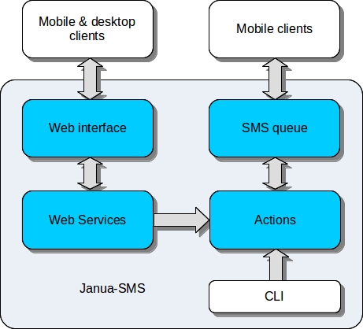

Architecture overview
=====================

Before starting installation, you should read the following section
to better understand architecture and features offer by Janua-SMS.

Description:
 * **Web interface:** `ExtJS <https://www.sencha.com/>`_ web interface for Janua-SMS management
 * **Web services:** web services and Rest API
 * **SMS queue:** Send/Receive persistent SMS queue
 * **Actions**

What does action mean here ?
----------------------------

It's the heart of Janua-SMS, the term active in "active SMS gateway" came from here.

An action contains functions which can be exposed to three contexts:
 * SMS
 * WEB
 * CLI (Command Line Interface)

| So each context can trigger and execute it's own function.
| Here what you can do by writing your own actions:

- trigger execution based on a specific keyword in received SMS
- trigger execution based on encoded SMS with specific parameters (see Janua-Client)
- create a new command for command line interface (option switch **action**)
- create a new web service by using GET or POST methods (create a web service)