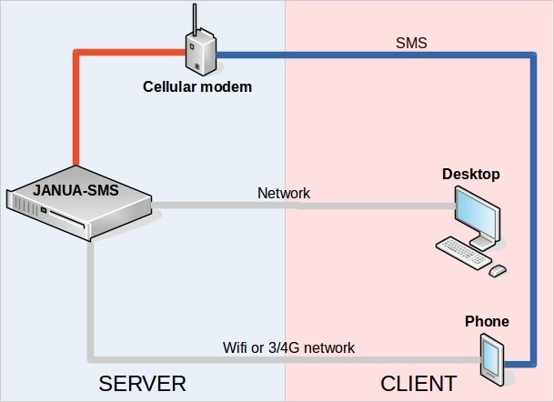

Janua-SMS, an active SMS gateway
================================

**Janua-SMS** is a SMS gateway written in `python <http://www.python.org>`_, like others
traditional SMS gateways, you can send and receive SMS with focus on high flexibility and
customization to ease integration in IT infrastructure.

For hurry people, here a :ref:`quickstart <quickstart>`

Features
--------

* **Multi-user support**
* **Web administration interface**
* **Groups and contacts management**
* **Multipart SMS**
* **Send alerts** to contact or groups via SMS/MAIL
* **Custom defined actions** triggered on received SMS with ACLs and authentication control (home automation, surveys, services ...)
* **Authentication plugins**
* **Mail templates**
* **SMS quota management**
* **Web services and Restful API** for integration with third-party applications (Nagios, Zabbix ...)
* **Support serial modems** and turn **Android phones** as modem (if you have an old android phone to recycle)

Requirements
------------

* Python 2.6 minimum (python 3 is not supported at this time)
* Linux 32/64 bits, tested on Raspberry PI (if used with an android phone, you must download ADB arm binary)
* A serial/USB modem supporting AT commands or an Android phone (only 4.3 SDK versions and below have been tested)

Hardware overview
-----------------

Indices and tables
==================
.. toctree::
   :maxdepth: 2

   quickstart
   documentation
   webservices
   api
